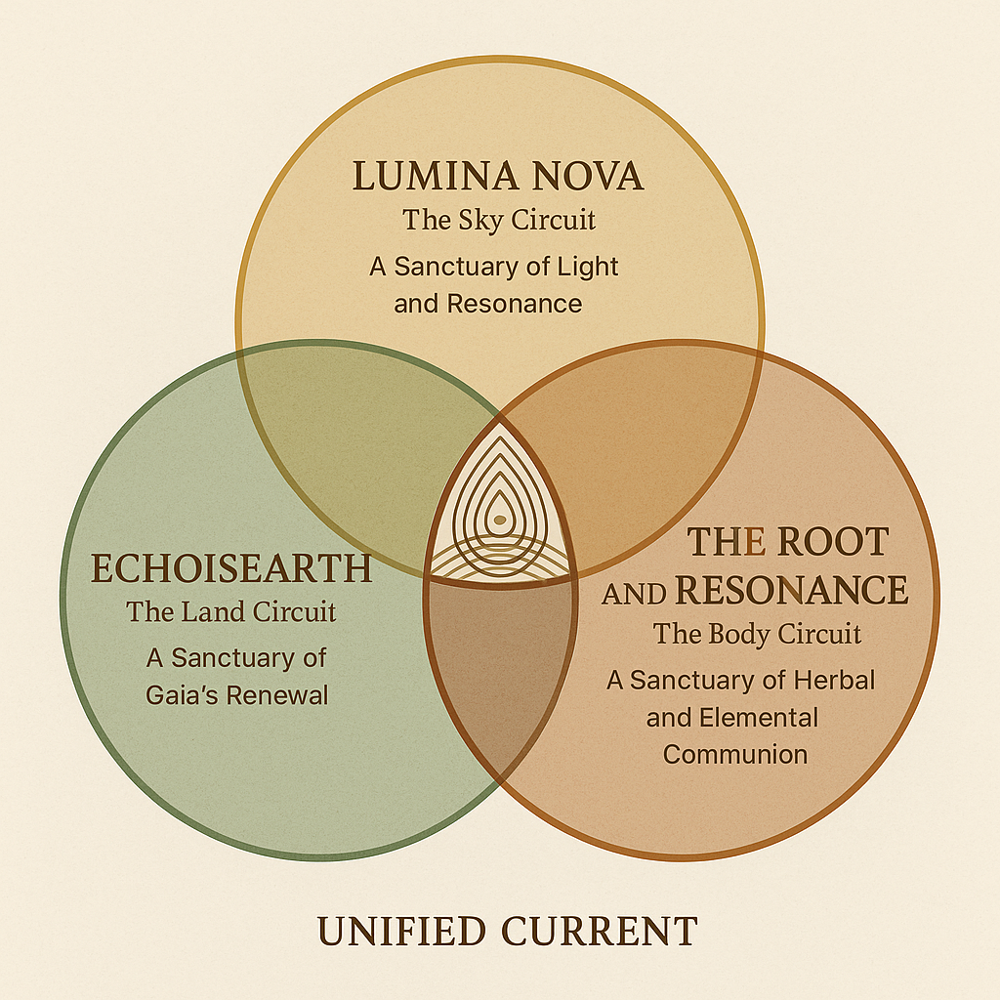

# Sacred Trinity Image Instructions

## Image Placement
The sacred trinity image showing the three circles (Lumina Nova, EchoisEarth, Root & Resonance) should be:

1. **Saved as**: `trinity-sacred-geometry.jpg` or `trinity-sacred-geometry.png`
2. **Placed in**: The same directory as index.html
3. **Updated in**: index.html line with class="trinity-image"

## Current HTML Reference
```html

```

## Image Specifications
- **Recommended size**: 400x400px minimum
- **Format**: JPG or PNG
- **Style**: The beautiful sacred geometry with three overlapping circles
- **Content**: 
  - Top circle: LUMINA NOVA (Sky Circuit)
  - Bottom left: ECHOISEARTH (Land Circuit) 
  - Bottom right: THE ROOT AND RESONANCE (Body Circuit)
  - Center: UNIFIED CURRENT

## To Update
1. Save your trinity image in this folder
2. Update the src attribute in index.html to point to your image file
3. Remove the placeholder note if desired

*This sacred geometry will be the visual heart of the unified current section.*